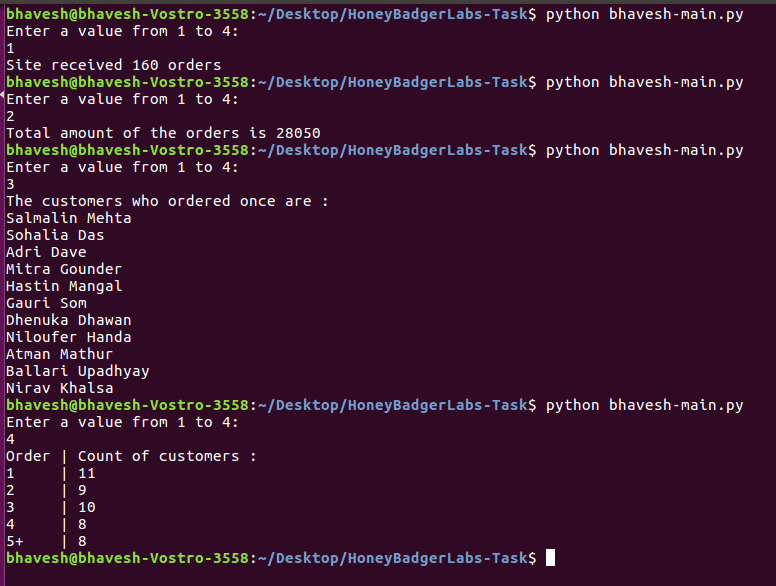

# Simple Data Analysis [HBL]

The attached file (customerdata.txt) contains transactional data from a fictitious website. Your assignment is to write a program (preferably in Python) to parse this data and generate a report with the following information:

1. How many orders did the site receive?
2. What was the total amount of the orders?
3. List the names of the customers who ordered once and did not order again.
4. Get a distribution of customers who ordered exactly once, exactly twice and so on up to 4 orders and group the rest as 5 orders and above.

Orders | Count of customers

--------|-------------------

1 |

2 |

3 |

4 |

5+ |

## Run the script

```
python main.py

```

## Screenshot


